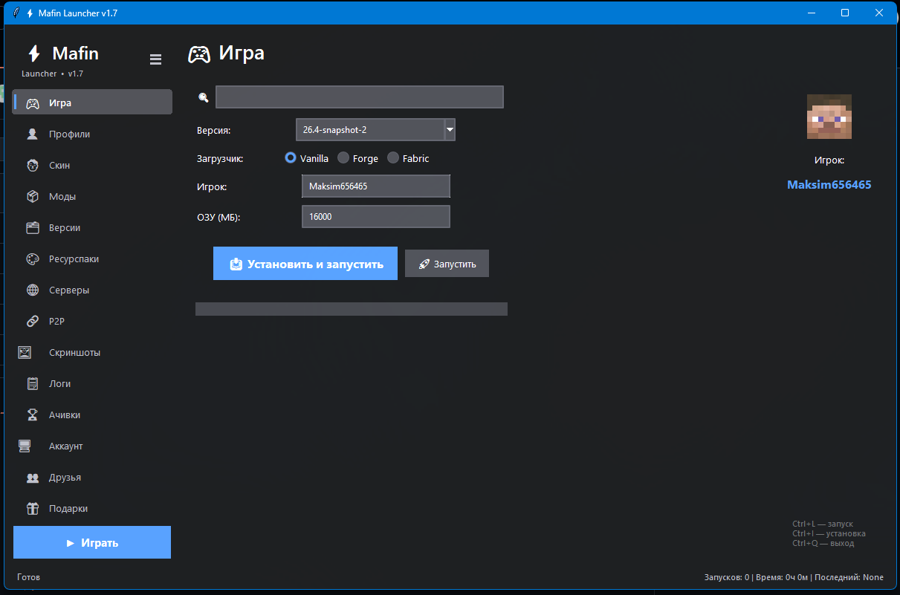
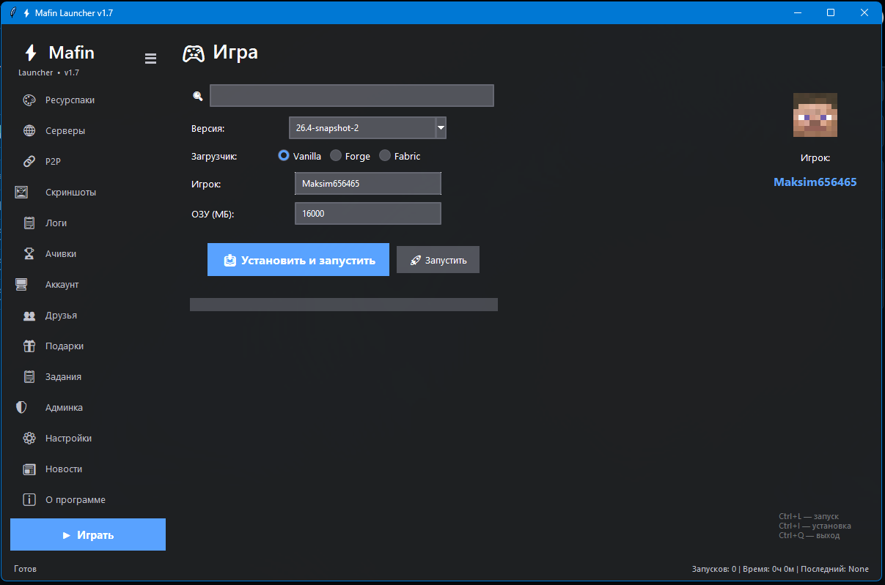
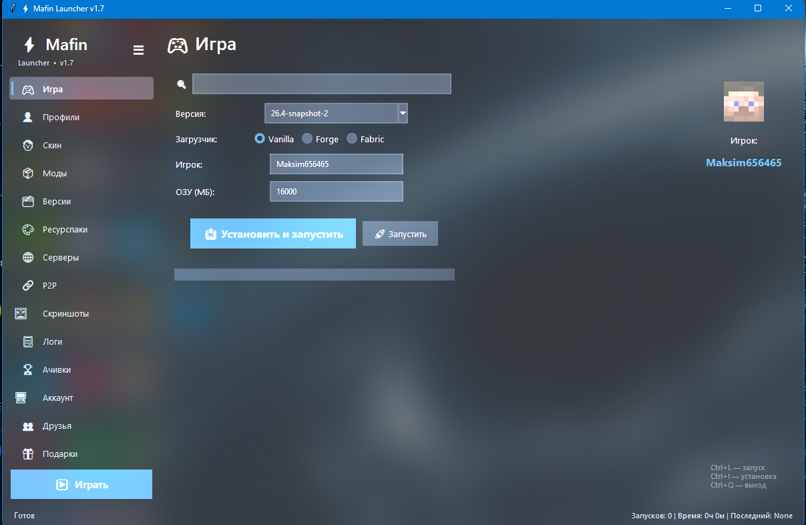
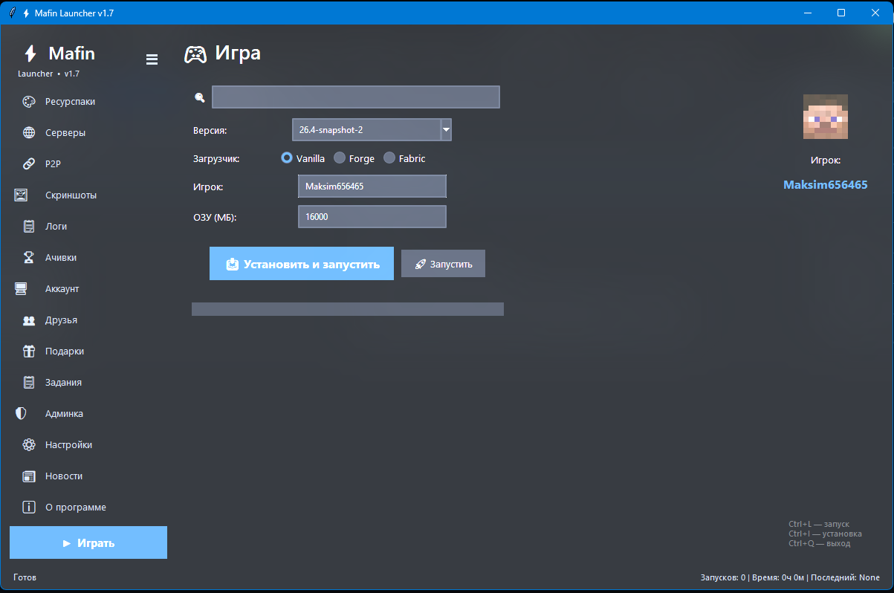

# ⚡ Mafin Launcher

Современный лаунчер для Minecraft на Python (tkinter) с оформлением в стиле Windows 11: **Mica**, **Mica Alt** и **Acrylic**.

*A modern Minecraft launcher written in Python (tkinter) with Windows 11 Mica / Mica Alt / Acrylic themes.*

## ✨ Возможности

- 🎮 Установка и запуск Vanilla, Forge и Fabric
- 👤 Профили, скины, моды, ресурспаки, менеджер версий
- 🌐 Серверы, P2P, скриншоты, логи
- 🏆 Ачивки, друзья, подарки, задания
- 🎨 Темы: материал окна (Mica / Mica Alt / Acrylic) + 5 акцентных цветов
- 🧭 Боковое меню в трёх стилях: список, пилюли, компактное
- ⌨️ Палитра команд (`Ctrl+K`), сворачивание панели (`Ctrl+B`), запуск (`Ctrl+L`), установка (`Ctrl+I`)
- 💬 Discord Rich Presence

## 📸 Скриншоты

<p align="center">

  
  

</p>


## 🗂 Состав репозитория

| Файл | Что это |
|------|---------|
| `launcher.py` | Сам лаунчер (клиент) |
| `app.py` | Сервер: аккаунты, ачивки, друзья, подарки, новости, обновления |
| `build2.py` | Билдер: собирает `MafinLauncher.exe` и установщик |
| `installer.iss` | Скрипт установщика для Inno Setup |
| `achievement.wav` | Звук ачивок (зашивается в exe) |

## 🚫 Что не входит в репозиторий

| Файл | Почему нет |
|------|------------|
| `icon.ico` | Иконка лаунчера, права на неё не подтверждены. Положи свою рядом с `launcher.py` |
| `achievement.wav` | Звук ачивок, права на него не подтверждены. Положи свой рядом с `launcher.py` (без него лаунчер работает, просто без звука) |

## 🚀 Запуск лаунчера из исходников

Нужны Python 3.12+ (с tcl/tk) и Java.

```bash
python -m pip install requests minecraft-launcher-lib pillow pypresence setuptools
python launcher.py
```

## 🔨 Сборка (build2.py)

Билдер собирает всё за один запуск: ставит недостающие зависимости, собирает `MafinLauncher.exe` через PyInstaller и, если установлен [Inno Setup 6](https://jrsoftware.org/isinfo.php), компилирует `installer.iss` в готовый установщик `MafinLauncherSetup.exe`. **Собирать нужно на Windows.**

```bash
python build2.py                          # exe + установщик
python build2.py --icon myicon.ico        # со своей иконкой (.ico)
python build2.py --exe-only               # только exe, без установщика
python build2.py --no-admin               # exe не будет запрашивать права администратора
```

Что нужно положить рядом с `build2.py`:
- `launcher.py` и `installer.iss` (обязательно);
- `achievement.wav` — звук ачивок, зашивается в exe;
- `opus.dll` — если нужна, копируется в `dist\` рядом с exe.

Результат: `dist\MafinLauncher.exe` и установщик в папке `Output\`. По умолчанию exe запрашивает права администратора (флаг `--no-admin` отключает это).

## 🖥 Сервер (app.py)

Бэкенд на **Flask + SQLite**: регистрация и вход, профили, достижения и топ, друзья и сообщения, подарки, задания, новости, раздача обновлений лаунчера и веб-админка (`/admin`).

```bash
python -m pip install flask
python app.py
```

Сервер слушает порт `10074` (`0.0.0.0`). Рядом создаются папка `updates/`, файл `.secret_key` (подпись сессий админки) и база `mafin_launcher.db`. Путь к базе по умолчанию **относительный** (от текущей папки), поэтому запускайте сервер и все команды `app.py` из одной и той же папки или задайте `MAFIN_DB_PATH` с полным путём.

### 🔐 Доступ в админку

В коде и переменных окружения **нет паролей админа**. Вход в `/admin` идёт по одноразовому коду, который можно получить только на самом сервере (то есть нужен SSH-доступ):

```bash
python app.py admin-code Ник --create   # первый раз: создаёт админа без пароля и выдаёт код
python app.py admin-code Ник            # дальше: новый код для существующего админа
```

1. Команда печатает код вида `E3TYR-HTPJJ`. Он живёт 5 минут и срабатывает один раз.
2. Откройте `/admin`, введите ник и код. Сессия админки живёт **30 дней**, потом нужен новый код.
3. В админке, в блоке «🔑 Пароль для лаунчера», задайте пароль (от 10 символов). После этого в лаунчер можно входить по нику и паролю. Пока пароль не задан, войти в лаунчер по этому нику нельзя.
4. Смена пароля там же требует текущий пароль.

Неверные попытки входа ограничиваются отдельно по нику и по IP.

### 🧰 Команды на сервере

| Команда | Что делает |
|---------|------------|
| `python app.py admin-code Ник` | Выдаёт одноразовый код для входа в `/admin` (админ должен существовать) |
| `python app.py admin-code Ник --create` | То же, но создаёт админа без пароля или выдаёт права существующему профилю |
| `python app.py set-password Ник` | Задаёт новый пароль лаунчера (ввод скрыт, от 12 символов), сбрасывает токен |

### 🛡 Если что-то утекло

- **Сессия или пароль игрока:** в `/admin` у каждого пользователя есть «Сбросить сессию» (выкидывает из лаунчера) и «Сменить пароль». Пароль другого админа отсюда менять нельзя: он меняет свой в блоке «Пароль для лаунчера», а владелец сервера может командой `set-password`.
- **Свой токен лаунчера:** кнопка «Сбросить мою сессию в лаунчере» в `/admin`.
- **Веб-сессия админки:** удалите `.secret_key` и перезапустите сервер, все админы будут разлогинены и получат новые коды.
- **Админ потерял доступ:** `python app.py admin-code Ник` даёт новый вход, `set-password` задаёт новый пароль.

### ⚙️ Переменные окружения

Все необязательные:

| Переменная | Назначение |
|------------|------------|
| `MAFIN_SECRET_KEY` | Ключ подписи сессий веб-админки. Если не задан, берётся из файла `.secret_key` (создаётся при первом запуске с правами 600) |
| `MAFIN_DB_PATH` | Путь к файлу базы данных (по умолчанию `mafin_launcher.db` в текущей папке) |
| `MAFIN_HTTPS` | Поставьте `1`, если сервер за HTTPS: cookie админки станут `Secure` |

### 🌍 Безопасность на рабочем сервере

- Поставьте сервер за HTTPS (nginx или Caddy) и задайте `MAFIN_HTTPS=1`.
- Админка нужна только администраторам, поэтому её удобно закрыть от интернета: в nginx разрешить `/admin` только с вашего IP, либо ходить по SSH-туннелю (`ssh -N -L 8080:localhost:10074 user@сервер`, затем `http://localhost:8080/admin`). Лаунчер использует только `/api/*`.
- За nginx для лимита попыток по IP приложению нужен реальный адрес клиента, а не `127.0.0.1`; без этого лимит по IP будет общим на всех, а лимит по нику продолжит работать.
- На VDS отключите вход по паролю в SSH (`PasswordAuthentication no`) и заходите по ключам.

Адрес сервера для лаунчера задаётся в `launcher.py` (константа `SERVER_URL`).

## 🪟 Про темы

Mica Alt работает на Windows 11 22H2 и новее, Mica — на Windows 11, Acrylic — на Windows 10 1803+. Если эффект не поддерживается, лаунчер автоматически переключается на классический фон.

## 📄 Лицензия

MIT — см. файл [LICENSE](LICENSE).
